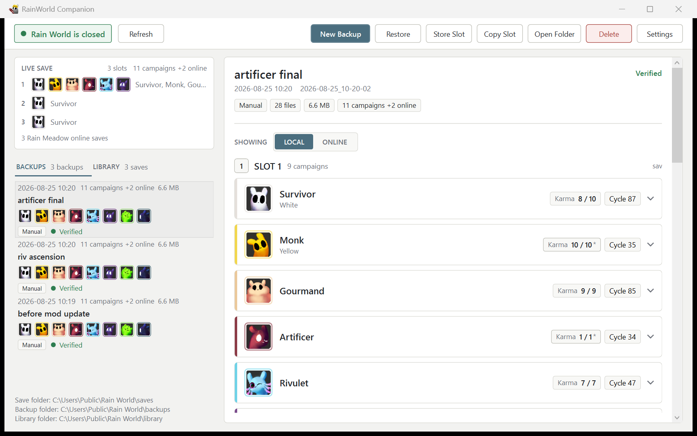
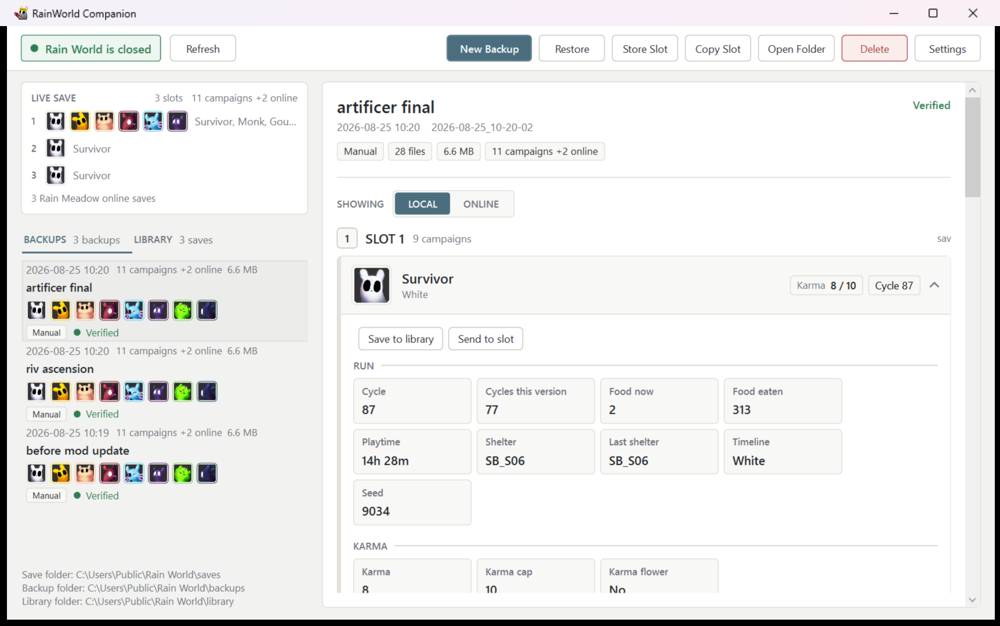
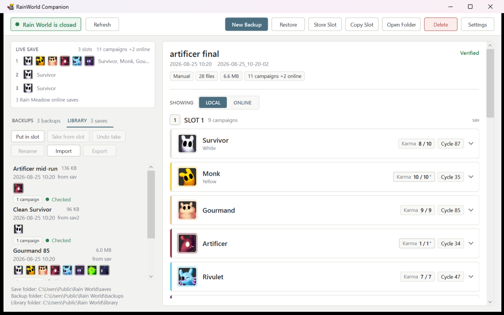
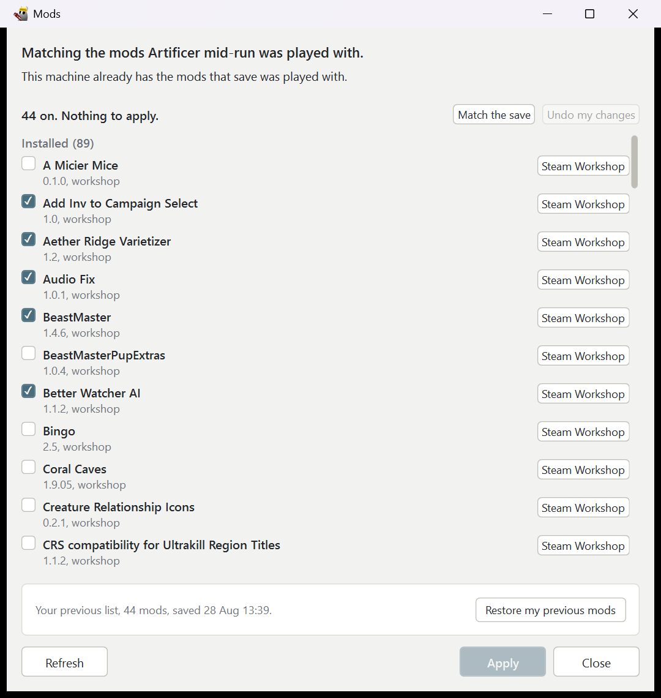
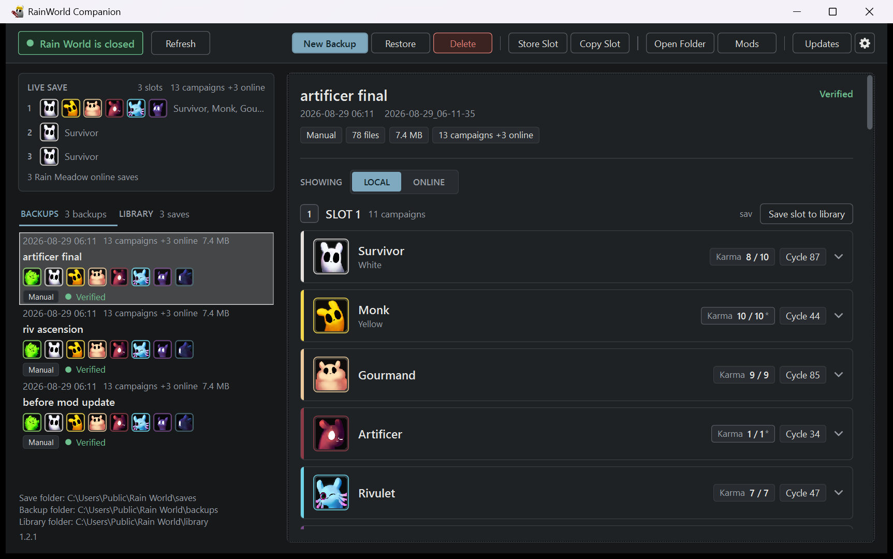

<p align="center">
  
</p>

<h1 align="center">RainWorld Companion</h1>

<p align="center">
  Back up your Rain World saves, read what is in them, and put any of them back.
</p>

A Windows desktop app that copies your Rain World save files into dated snapshots and restores
them on demand. It reads the save containers well enough to show what each slot holds, from the
slugcat and the cycle down to karma, passages and kills, so you can tell one snapshot from
another before you restore it.

It also keeps a library of named saves outside the game's three slots, so twenty runs can sit
ready to load into any slot. It can copy one slot onto another, lift a single campaign out, and
it reads Rain Meadow's online saves beside the local ones.

It turns mods on and off too, without opening the game, and every save it keeps records the mods
and settings it was played with so a run can be put back the way it was.



The list on the left is the live save folder and every backup under it. Selecting either fills
the panel on the right, in the same layout for both, so a backup can be read against the live
save without switching views.



Opening a campaign shows what the save records: the cycle, food, playtime and shelter,
the karma and the flags that go with it, deaths and quits, the echoes met, the gates unlocked and
the creatures killed.



The library holds saves outside the game's three slots. An entry can be a whole slot or a single
campaign lifted out of one, and any of them can be put back into any slot.



The Mods window turns mods on and off without opening the game. Opened from a save, it says how
the mods on now differ from the ones that save was played with, and Match the save puts them back.



There is a dark theme as well as the light one, under Settings.

The slugcat art is read from your own Rain World install at runtime. None of it is copied into
this repo or shipped with the app.

---

## Installing

Download `RainWorldCompanion-Setup.exe` from the
[releases page](https://github.com/mkiera/RainWorldCompanion/releases) and run it. It installs
for you alone, asks for no admin rights, and the .NET runtime is inside the download. To update,
run a newer setup over the top.

Uninstalling removes the program and its settings. **It does not touch your backups or your save
library.** Delete those folders yourself when you want them gone.

---

## Contents

- [What it manages](#what-it-manages)
- [Mods](#mods)
- [Supported mods](#supported-mods)
- [Copying a slot](#copying-a-slot)
- [The library](#the-library)
- [Backups and restores](#backups-and-restores)
- [Steam Cloud](#steam-cloud)
- [Where things are stored](#where-things-are-stored)
- [Building](#building)

---

## What it manages

The app copies, overwrites and deletes only these files, matched by exact name, and nothing else
in the save folder:

- `sav`, `sav2`, `sav3` (story slots 1 to 3)
- `exp<n>` and `expCore<n>` (expedition state)
- `online_sav`, `online_sav2`, `online_sav3` (Rain Meadow), the `online_sav-<n>` names a lobby
  joined from an Expedition slot writes, and `meadow.json`
- `buffMain<n>` and `buffsave<n>` (RandomBuff)
- the whole `ModConfigs\` folder, so a mod that keeps its settings in a `.json` or a subfolder
  of its own is covered as well as one that writes a plain `.txt`
- the `dvrmentSaveStates\`, `dressmyslugcat\`, `RandomBuff\` and `Warp\` folders, with
  everything inside them

Anything the game or Steam rewrites on its own stays out of scope: `localoptions.txt`, the
`SJ_<n>` karma screenshots, `steam_autocloud.vdf`, Steam's `cloud\` and the game's own
`backup\`. The name match is exact, so files like `sav - Copy` and `sav.bak` are not touched,
and nothing is copied through a junction or symlink.

`options` and `enabledMods.txt` are the one exception, and only the [Mods](#mods) window writes
them. They are deliberately outside the backup scope: they hold which mods are on rather than
anything about a run, so a restore leaves your mod list alone. The Mods window keeps named lists
and the 10 most recent lists captured before Apply separately from save backups.

---

## Mods

The Mods window turns Rain World's mods on and off without opening the game. It lists every mod
you have with a tick beside it, and Apply writes what the game reads the next time it starts.

Turning a mod on turns on the mods it needs, the way the game's own Remix menu does. It follows
the chain to the end, so a requirement that has requirements of its own comes too. A requirement
you do not have is named instead, because that is the reason the mod may still not work.

Every backup and library save records the mods and game version it was played with, and carries
that record inside a `.rwsave` when it is exported. Restoring, loading or sending a save says how
this machine has moved since those bytes were written: what is missing, what is turned off, and
what sits at another version. None of it blocks the operation. Match the save previews that list
in the Mods window. Apply writes it after you review the ticks. A mod you do not have gets a button
to its Steam Workshop page, which opens in Steam where it is installed.

Current list can import and export `.rwmods` files. Importing previews the file and offers to keep
it as a named profile. Saved lists holds those profiles and the 10 most recent lists captured
before Apply. Loading any profile or earlier list returns to Current list for review. Applying an
earlier list captures the list it replaces, so the change can be undone the same way.

Mod settings travel too. A library save and a `.rwsave` carry the settings that were in
`ModConfigs\` when the bytes were taken, and loading one asks which mods' settings to take, per
mod, taking none unless you tick them. Take settings does the same without writing a slot.
Every list of them says whether they are the same as the ones you have, different, or new to you.

Writing settings over your own is undone the same way every other write is: by restoring the
safety backup taken first.

---

## Supported mods

Everything here is optional: a mod that is not installed leaves no trace, and the app shows
nothing about it. Mod settings are covered for all of them, and for mods this list has never
heard of, because the whole `ModConfigs\` folder is backed up. The sections below are the mods
whose saves the app reads and shows in detail.

<details>
<summary><b>Rain Meadow</b>: online saves read and shown beside the local ones</summary>
<br>

Rain Meadow keeps a second save per slot, `online_sav2` beside `sav2`, in the same format, so one
reader handles both. A toggle above the slot sections switches them between the three local saves
and the three online ones, and a paired section lower down shows both halves of each slot side by
side. The panel also reads `meadow.json`, the mod's own progression file.

The toggle and the paired section appear only when Rain Meadow is on the machine, so a player
without the mod sees one set of saves and no toggle over them.

</details>

<br>

<details>
<summary><b>RandomBuff</b>: save data backed up and restored</summary>
<br>

`buffMain<n>`, `buffsave<n>` and the `RandomBuff\` folder are carried whole, so a restore puts
the run back the way the mod left it.

</details>

<br>

<details>
<summary><b>Dress My Slugcat</b>: appearance data backed up and restored</summary>
<br>

The `dressmyslugcat\` folder is copied whole.

</details>

<br>

<details>
<summary><b>Warp</b>: save data backed up and restored</summary>
<br>

The `Warp\` folder is copied whole.

</details>

---

## Copying a slot

Copy Slot in the top bar picks a source and a target from the three local slots and, with Rain
Meadow installed, the three online ones. Any slot can be copied onto any other. The confirmation
names both files, their sizes and what is in each, and it re-describes the copy whenever you
change a picker, so what it names is what will run.

A copy replaces the whole target file byte for byte and takes a safety snapshot of the save
folder first, so the file it overwrote can be put back by restoring that snapshot.

---

## The library

Rain World gives you three slots. The library is a folder of named saves outside them, so a run
you want to come back to does not have to hold a slot open. The LIBRARY tab lists what you have
stored, with the same faces and check state the backup rows carry, and selecting one fills the
same detail panel.

- **Store Slot** keeps a copy of one slot under a name of your choosing. The copy is proved
  against the file it came from before it is recorded, and nothing in the save folder is written.
- **Put in slot** writes a library save into whichever slot you pick, local or online.
- **Take from slot** replaces a library save with what is in that slot now, which is how an hour
  of play gets back into the save it came from. The replaced save is kept, and **Undo take** puts
  it back.
- **Export** writes a save out as a single `.rwsave` file. **Import** reads one back, and also
  accepts a bare save file copied straight out of somebody's save folder.

A row says which slot holds it and whether that slot has been played since. Putting a save into a
slot is the only library operation that writes into the save folder, and it runs the same steps a
slot copy runs: safety snapshot first, then one byte for byte copy, verified on both sides. A
library save or a `.rwsave` bundle that no longer matches its recorded checksum is refused rather
than written over a live slot.

---

## Backups and restores

Close Rain World first. Anything that reads or writes a save file is refused while the game is
running, and the window header shows whether it is open. The check repeats during a restore or a
copy, so a game launched mid-operation stops it rather than racing it.

Every file copied into a backup is verified against the file it came from: same length, same
timestamp, same SHA-256 on both sides. A save that changes during the copy is copied again, and
every backup is re-hashed against its manifest in the background after the list loads.

Restoring makes the in-scope part of the save folder match the backup exactly. In-scope files the
backup does not have are deleted, which is what makes a restore a return to one moment rather
than a merge, and the confirmation lists every add, overwrite and delete before anything runs.

Every restore and slot copy takes a safety snapshot of the save folder first and keeps it in the
backup list, so the state before the operation can always be put back. Backups taken before this
version covered fewer files, and a restore deletes a file only when the backup's own rules
covered it too, so restoring an old backup does not delete files added to the list since.

---

## Steam Cloud

Rain World syncs its saves through Steam Cloud, which reads and writes the same files this app
does. Close the game and give Steam a moment to finish syncing before backing up. A backup that
fails with a message about a file changing while it was copied usually means a sync was still
running.

After a restore, launch Rain World through Steam before you restart Steam. If a Steam Cloud
Conflict dialog appears, choose the option that keeps the local files, which is worded as
uploading to Steam Cloud. Choosing the cloud copy replaces the saves you just restored.

---

## Where things are stored

The save folder is detected at `%USERPROFILE%\AppData\LocalLow\Videocult\Rain World`. Backups go
to `%LOCALAPPDATA%\RainWorldCompanion\backups`, library saves to
`%LOCALAPPDATA%\RainWorldCompanion\library`, and settings to
`%LOCALAPPDATA%\RainWorldCompanion\settings.json`. All three folders can be pointed elsewhere in
Settings, and none of them may sit inside another.

Mod list profiles and recent history are kept under
`%LOCALAPPDATA%\RainWorldCompanion\modstate`. Each profile and history entry has its own JSON file,
so one damaged entry does not hide the others. This folder records mod selection and load order.
It contains no saves, mod files or mod configuration files, and it cannot be moved in Settings.

Each backup is one folder named for the moment it was taken, for example `2026-08-24_19-31-07`,
holding the copied files in the same layout they have in the save folder plus a `manifest.json`
listing every file with its size and SHA-256. The manifest is written last, so a folder without
one is a backup that did not finish, and the app refuses to restore it.

This app was called Rain World Save Manager until August 2026. On first launch after the rename
it renames the old `%LOCALAPPDATA%\RainWorldSaveManager` folder and updates stored paths to
match. A folder you pointed somewhere else yourself is left exactly where you put it.

---

## Building

Requires the .NET 9 SDK. The library and the tests target `net9.0`. The app targets
`net9.0-windows` and uses WPF, so it builds and runs on Windows only.

```
dotnet build RainWorldCompanion.sln
dotnet test RainWorldCompanion.sln
```

The tests read byte-exact save fixtures captured from a real installation and write only to
temporary directories. No test reads or writes a live save folder.
